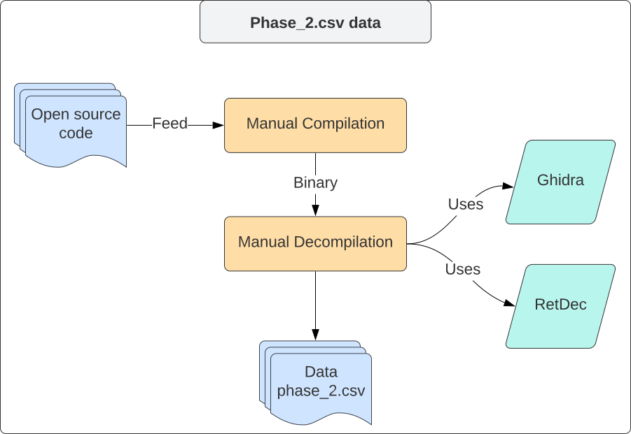
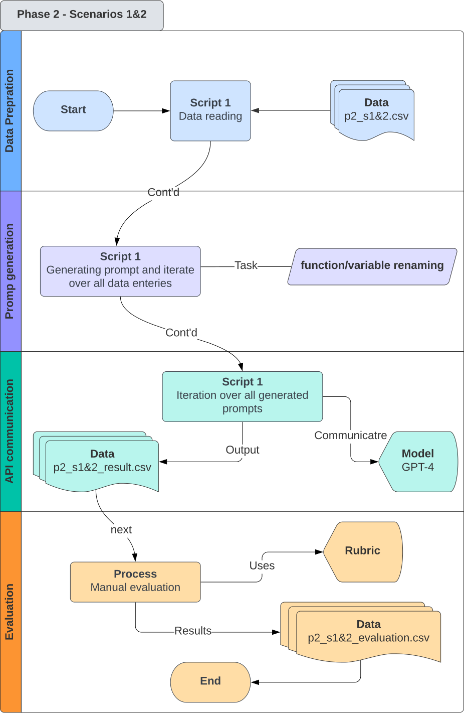
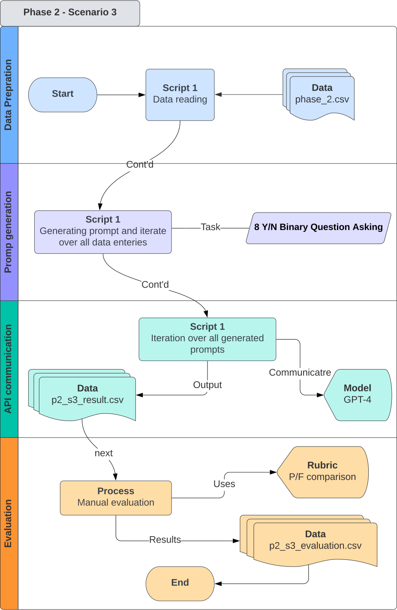
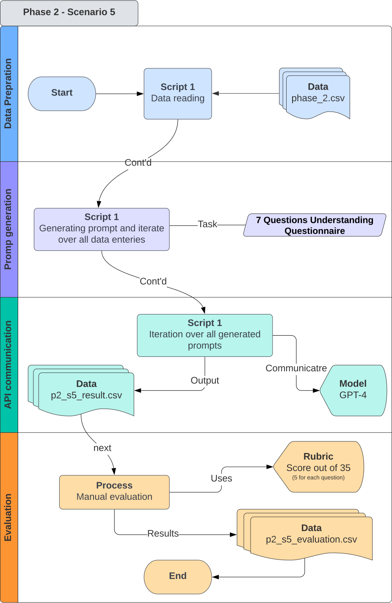

# Phase_1

In Phase 1 of our experiment, we explore the capability of GPT-4 in providing explanations for C programming code. Our objective is to assess the AI model's proficiency in understanding and elucidating programming concepts, which is critical for educational purposes and assisting novice programmers.

# Data

## Source

We collected 70 C programming exercises from [Programiz](https://www.programiz.com/), a renowned tutorial website. This source was chosen due to its comprehensive coverage of programming concepts, ranging from basic to advanced levels.

## **Structure**

The data is organized in a **`.csv`** file with the following columns:

- **`id`**: Problem number on the website.
- **`problem_name`**: Title of the problem.
- **`explanation`**: Human-written explanations for each problem.
- **`output`**: Expected output of the code.
- **`original_code`**: The complete C code solution, typically containing comments.
- **`comment_less_code`**: The original code stripped of comments for a cleaner look.

## **Why This Data?**

This dataset was selected for its diversity in programming problems and its simplicity of application in learning environments. The structured format facilitates systematic analysis and comparison.

# ****Experiment Design****

## **GPT-4**

We choose GPT-4 as our chosen model for this phase of the experiment, as this model is the most capable OpenAI model, as well as one of the best current LLMs through all open source and commercial models at this time.  

## **BLEU Score Evaluation**

We utilized the BLEU score, a standard metric for evaluating machine-generated text against human-written references, to assess the quality of explanations provided by GPT-4 compared to the original explanations in the dataset.

## **Token Estimation**

For each scenario, we estimated the token size of prompts and responses to manage our usage of the GPT-4 model efficiently and based on [OpenAI API pricing](https://openai.com/pricing). Based on OpenAI's tokenizer, each 4 characters are one token. As a result, our token estimation for each scenario in the phase_1 is based on the following:

- Input
    
    **`((fixed prompt # of token + average of code # of characters)/4) * 70 samples * input gpt-4 api price`**
    
- Output
    
    `**(requested output characters 80 / 4) * 70 samples * output gpt-4 api pricing**`
    

## Scenario_1

<div style="text-align: center;">
    
</div>


In the first scenario, we will pass commented original code to the GPT-4 and ask the model for generating explanation on the code. Then, we'll store the result for later BLEU score calculation versus original explanation on the application that we gathered from the source code website. We will query 70 times on GPT4 and storing responses on a `.csv` file 

### Prompt

```
Problem Name: <problem_name>

<code_secion> 

Please provide an explanation of this C code in a concise and straightforward manner, similar to a brief textbook definition. Focus on the main components and their basic functions, avoiding technical jargon. Aim for an explanation of around 60-80 words, suitable for beginners in programming.
```

- This prompt contains the <problem_name> for guiding better the model on what it's going to explain.
- The code which is being used for this prompt is the <code_secion> which contains reasonable comments on the code.
- Also, we have "C code" comment for giving the model about the programming language.

### Experimental Data

Dat for this phase can be found in this [link](https://github.com/sinapordanesh/Exploring-the-Efficacy-of-Large-Language-Models-GPT-4-in-Binary-Reverse-Engineering/tree/main/data/phase_1).

- `phase_1_data.csv`

## Scenario_2

<div style="text-align: center;">
    
</div>

In the second scenario, we will pass **un-commented** original code to the GPT-4 and ask the model for generating explanation on the code. We also removed the problem_name from the prompt for making the code a bit more unclear. Then, we'll store the result for later BLEU score calculation versus original explanation on the application that we gathered from the source code website. We will query 70 times on GPT4 and storing responses on a `.csv` file 

### Prompt

```
<code_secion> 

Please provide an explanation of this code in a concise and straightforward manner, similar to a brief textbook definition. Focus on the main components and their basic functions, avoiding technical jargon. Aim for an explanation of around 60-80 words, suitable for beginners in programming.
```

- This prompt contains the <problem_name> for guiding better the model on what it's going to explain.
- The uncommented code will be placed on <code_secion>.

### Experimental Data

Dat for this phase can be found in this [link](https://github.com/sinapordanesh/ENEL-592-Project/tree/main/data/phase_1).

- `phase_1_data.csv`

## Scenario_3

<div style="text-align: center;">
    
</div>

In the third scenario, we will pass decompiled code to the GPT-4 and ask the model for generating explanation on the code. For reaching to the decompiled code, we first compiled the code using gcc and then decompiled all resulted binary using Ghidra. Afterwards, we gathered all resulted decompiled code on a new `.csv` file. Then, we'll store the result for later BLEU score calculation versus original explanation on the application that we gathered from the source code website. We will query 70 times on GPT4 and storing responses on a `.csv` file.

### Prompt

```
<code_secion> 

Please provide an explanation of this C code in a concise and straightforward manner, similar to a brief textbook definition. Focus on the main components and their basic functions, avoiding technical jargon. Aim for an explanation of around 60-80 words, suitable for beginners in programming.
```

- We put decompiled code on <code_secion> section of each prompt in each iteration over dataset.

### Experimental Data

Dat for this phase can be found in this [link](https://github.com/sinapordanesh/ENEL-592-Project/tree/main/experiment/data/phase_1).

- `phase_1_data.csv`
- `phase_1_data_decompiled`

--------------------------------------------------------------------------------------

# Phase_2
In this scenario, we will focus more on some real world malware analyziz by providing 15 malware samples from open source repositories for feeding 5 different LLM evaluation scenarios on reverse engineering tasks. 

# Data

<p align="center">
  
</p>

## Source

In Phase 2, our experiment delves into malware understanding. All compilation and decompilation processes occurred in an isolated environment to maintain safety and integrity. No scripts or binary files from this phase are included in the GitHub repository. Data sources vary across samples, as specified in the data file.

Access the data [here](https://github.com/sinapordanesh/ENEL-592-Project/tree/main/experiment/data/phase_2). Key files and folders:

- **[`phase_2.csv`](https://github.com/sinapordanesh/ENEL-592-Project/blob/main/experiment/data/phase_2/phase_2.cvs.csv)**
- [code](https://github.com/sinapordanesh/ENEL-592-Project/tree/main/experiment/data/phase_2/code) directory

## Structure

1. **`id`**: Unique identifier for each data row.
2. **`source`**: URL of the source code or related information.
3. **`Compilation`**: Compilation status.
4. **`Platform`**: Target operating system or environment.
5. **`original_code`**: Original source code, typically in C.
6. **`Function_names`**: Function names used in the code.
7. **`Variable_names`**: Variable names used in the code.
8. **`Comments`**: Source code comments.
9. **`decompiled_Ghidra`**: Ghidra decompiled code.
10. **`decompiled_RetDec`**: RetDec decompiled code.

# ****Experiment Design****

## **GPT-4**

We choose GPT-4 as our chosen model for this phase of the experiment, as this model is the most capable OpenAI model, as well as one of the best current LLMs through all open source and commercial models at this time.  

## **Evaluation**

Evaluations vary in each scenario. We mostly used manual evaluation based on pre-designed rubrics for better human judgment on the machine results. More details can be found at the experiment report file.

## **Token Estimation**

Token estimations are different in each scenario. Ditailed token estimation section is included in each scenario section. 

# ****Experiments****

## Scenario_1&2: Variable & Function Name Detection

<p align="center">
    
</p>

We used 10 sample data rows from the first phase to understand variable and function naming better. We aimed to enhance readability and comprehension by assigning meaningful and human-readable names to functions and variables.

- The data file for these two scenarios: **[`p2_s1&2.csv`](https://github.com/sinapordanesh/ENEL-592-Project/blob/main/experiment/process/phase_2/s1%262/p2_s1%262.csv)**

### **Prompt**

```
I have a section of decompiled C code with function and variable names that are difficult to understand. I need help in renaming these functions and variables to be more human-readable and sensible. Here is the code snippet:

<code>

Please provide a list of all original variable and function names and their proposed new names in two JSON formats like {"variables": [ {"originalName": "", "newName": ""}]} and {"functions": [ {"originalName": "", "newName": ""}]}. I only need the list of variable names in the JSON, nothing else in the response, even a single word.
```

### Token estimation for S1&2

- decompiled code:
    - Input →  (120 + 12794/4) (each row) * 15 (all rows)  = 49,777
    - Output → Unknown
- Totla → 18,390 + 51,652 =70,042
- Cost
    - GPT4 → (70,042/1000) * 0.03 = `$2.10` + `?`
    - GPT3.5 Turbo → (70,042/1000) * 0.0010 = `$0.070` + `?`

### **Evaluation**

We developed a rubric focusing on meaningfulness and effectiveness of the renamed entities.

| Criteria | Score 0 (Needs Improvement) | Score 1 (Acceptable) | Score 2 (Good) | Score 3 (Excellent) |
| --- | --- | --- | --- | --- |
| Meaningfulness | Name is unclear or irrelevant | Name gives a basic idea of purpose but could be clearer | Name is clear and relevant to its role | Name is highly descriptive and precisely indicates its role |
| Effectiveness | Name hinders understanding and does not follow conventions | Name is somewhat easy to understand and follows basic conventions | Name enhances understanding and follows good conventions | Name is exemplary in enhancing readability and adhering to best practices |
1. **Meaningfulness (0-3 points)**
    - Assesses how well the name reflects the function or variable's purpose and relevance to its role.
    - A high score means the name is highly descriptive and helps someone understand what the function or variable is for at a glance.
2. **Effectiveness (0-3 points)**
    - Evaluates the overall impact of the name on code readability and adherence to naming conventions.
    - A high score is given when the name not only makes the code easier to understand but also exemplifies best practices in naming.

---

## Scenario_3: Binary Understanding

<p align="center">
    
</p>

This section involved setting a series of questions to evaluate the code's functionality and security implications. Questions only have binary Y/N answers. For more information about why these questions where selected, please refer to the experiment's report. 

### Questions set

Includes criteria like Function Identification, Control Structures, Scalability, Suspicious API Calls, Network Activity, Encryption Routines, Stealth Techniques, and Persistence Mechanisms.

| No | Evaluation Criteria | Question | Response Type |
| --- | --- | --- | --- |
| 1 | Function Identification | Can you identify the main functions in the code? (YN) | YN |
| 2 | Control Structures Comprehension | Is this code a network-related program?(YN) | YN |
| 3 | Scalability Consideration | Do you think the code is scalable? (YN) | YN |
| 4 | Suspicious API Calls | Does the code make calls to suspicious or potentially harmful APIs, such as those related to keyboard logging, screen capturing, or modifying system files?(YN) | YN |
| 5 | Network Activity | Does the code establish network connections or send data over the network without user consent? (YN) | YN |
| 6 | Encryption Routines |  Are there routines for encrypting files or data that seem unrelated to the program's core functionality? (YN) | YN |
| 7 | Stealth Techniques |  Does the code attempt to hide its presence or activity, such as disguising its processes or modifying log files? (YN) | YN |
| 8 | Persistence Mechanisms | Are there mechanisms ensuring the code executes on system startup or remains active in the background? (YN) | YN |

### Prompt

```
I have a section of C code and need to know specific aspects of its functionality and security implications. Please answer the following questions with either 'Y' for Yes or 'N' for No, and match your answers with the corresponding question ID.

Can you identify the main functions in the code? (YN)
Is this code a network-related program? (YN)
Do you think the code is scalable? (YN)
Does the code make calls to suspicious or potentially harmful APIs, such as those related to keyboard logging, screen capturing, or modifying system files? (YN)
Does the code establish network connections or send data over the network without user consent? (YN)
Are there routines for encrypting files or data that seem unrelated to the program's core functionality? (YN)
Does the code attempt to hide its presence or activity, such as disguising its processes or modifying log files? (YN)
Are there mechanisms ensuring the code executes on system startup or remains active in the background? (YN)

Here is the code snippet:

<code>

I need the answers in a concise format, with each response directly corresponding to the question number.
Just return Y or N in front of each question ID, without any extra word!!
```

### **Token Estimation:**

- original code:
    - Input →  (245 + 3924/4) (each row) * 15 (all rows)  = 18,390
    - Output → Minor
- decompiled code:
    - Input →  (245 + 12794/4) (each row) * 15 (all rows)  = 51,652
    - Output → Minor
- Totla → 18,390 + 51,652 =70,042
- Cost
    - GPT4 → (70,042/1000) * 0.03 = `$2.10`
    - GPT3.5 Turbo → (70,042/1000) * 0.0010 = `$0.070`

---

## Scenario_4: Function Explanation

<p align="center">
    
</p>

Comparing GPT-4 responses on original and decompiled code, focusing on function explanations from the perspective of reverse engineering and security analysis.

### Prompt

```
I have a C code that I need explained from the perspectives of both a reverse engineer and a security specialist. The code is as follows:

<code>

Please provide a detailed but concise analysis in no more than 100 words. Your explanation should cover the following points in a repetitive format for each code snippet:

Functionality Overview: Briefly describe the main purpose and functionality of the code.
Key Observations by a Reverse Engineer: Highlight any notable structures, patterns, or algorithms from a reverse engineering standpoint.
Security Analysis: Identify any potential security risks or vulnerabilities present in the code.
Remember, the format and structure of your analysis should be consistent for each code snippet, as the responses will be compared using BLEU score.

NO MORE THAN 200 WORDS!!
```

### **Token Estimation:**

- original code:
    - Input →  (151 + 3924/4) (each row) * 15 (all rows)  = 16,980
    - Output → 200/4 * 15 =  750
- decompiled code:
    - Input →  (151 + 12794/4) (each row) * 15 (all rows)  = 50,242
    - Output → 200/4 * 15 =  750
- Totla
    - Input → 16,980 + 50,242 =67,222
    - Output → 1500
- Cost
    - GPT4 → (67,222/1000) * 0.03 + 1500/100 * 0.06 = `$2.106`
    - GPT3.5 Turbo → (67,222/1000) * 0.0010 = `$0.067`

### **Evaluation**

Rubric for Reverse Engineering Explanation Evaluation with categories including Functionality Overview, Key Observations, Security Analysis, Clarity, and Structure. Total score ranges from 0-20.

| Category | Criteria | Score (0-5) | Notes |
| --- | --- | --- | --- |
| 1. Functionality Overview | Accuracy of code's purpose | 0-5 | Higher scores for detailed and accurate summaries. |
| 2. Key Observations | Depth of technical insight | 0-5 | Focus on insightful and precise observations. |
| 3. Security Analysis | Identification and analysis of risks | 0-5 | Depth of vulnerability analysis matters. |
| 4. Clarity and Structure | Overall clarity and organization | 0-5 | Clear, well-structured responses score higher. |
- Total Score: 0-20
- Scoring Guidelines
    - **0 points**: No attempt or off-topic.
    - **1-2 points**: Basic or with significant inaccuracies.
    - **3-4 points**: Accurate and insightful, well-structured.
    - **5 points**: Exceptionally clear, insightful, and comprehensive.
- Notes:
    - Use the original code explanation as a reference to score the decompiled code explanation.
    - Each category should be scored independently.
    - The evaluator should focus on the accuracy and clarity of the explanations, considering the technical context.

---

## Scenario_5: Understanding Questionnaire

 

<p align="center">
    
</p>

The objective of this scenario is deepen understanding of the code through a set of specific questions.

### Questions set

Includes primary functionality, key functions, variable roles, error handling, execution flow, external libraries, and security concerns.

| Question Number | Question |
| --- | --- |
| 1 | What is the primary functionality of the code? |
| 2 | Identify and describe the purpose of three key functions in this code. |
| 3 | Select a variable and explain its role in the code. |
| 4 | How does the code handle errors or exceptions? |
| 5 | Describe the flow of execution in a specific section of the code. |
| 6 | What external libraries or dependencies does the code rely on? |
| 7 | Are there any security concerns evident in the code? |

### Prompt

```
Analyze the provided code snippet and answer the following questions. 

Code:

For each of the following questions, provide a concise response of approximately 50 words only:

1. What is the primary functionality of the code?
2. Identify and describe the purpose of three key functions.
3. Explain the role of a selected variable.
4. Describe the error handling mechanism.
5. Outline the flow of execution in a specific section.
6. List any external libraries or dependencies.
7. Highlight any evident security concerns.

APRROXIMATLY 350 WORDS IN RESPONSE ONLY! NO MORE!
```

### **Token Estimation:**

- original code:
    - Input →  (151 + 3924/4) (each row) * 15 (all rows)  = 16,980
    - Output → 350/4 * 15 = 1,312
- decompiled code:
    - Input →  (151 + 12794/4) (each row) * 15 (all rows)  = 50,242
    - Output → 350/4 * 15 = 1,312
- Totla
    - Input → 16,980 + 50,242 =67,222
    - Output → 2,625
- Cost
    - GPT4 → (67,222/1000) * 0.03 + 2625/1000 * 0.06= `$2.1735`
    - GPT3.5 Turbo → (67,222/1000) * 0.0010 = `$0.067`

### Evaluation

Rubric with criteria based on accuracy, detail, and insight for each question. Total score ranges from 0-35.

| Question | Criteria | Score (0-5) | Notes |
| --- | --- | --- | --- |
| 1. Primary Functionality | Accuracy and completeness | 0-5 | How well does the response match the reference? |
| 2. Key Functions Description | Detail and relevance | 0-5 | Are the key functions identified and explained well? |
| 3. Role of Selected Variable | Clarity and accuracy | 0-5 | Does the response clearly explain the variable's role? |
| 4. Error Handling Mechanism | Depth of understanding | 0-5 | Is the error handling mechanism well-described? |
| 5. Flow of Execution | Clarity in outlining execution flow | 0-5 | How accurately is the flow described? |
| 6. External Libraries/Dependencies | Comprehensiveness | 0-5 | Are all relevant libraries/dependencies listed? |
| 7. Evident Security Concerns | Insight into security implications | 0-5 | How well are the security concerns highlighted? |
- Total Score: 0-35
- Scoring Guidelines
    - **0 points**: No attempt or irrelevant response.
    - **1-2 points**: Basic or with significant inaccuracies.
    - **3-4 points**: Mostly accurate, some minor inaccuracies or missing details.
    - **5 points**: Very accurate, detailed, and aligns closely with the reference response.
- Notes:
    - Use the original code responses as the reference for scoring.
    - Evaluate each response independently, focusing on how well it aligns with the reference in terms of accuracy, detail, and insight.
    - The evaluator should have a good understanding of code analysis to accurately score the responses.

